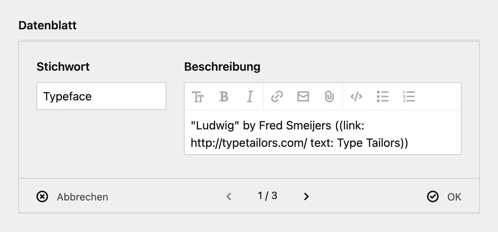
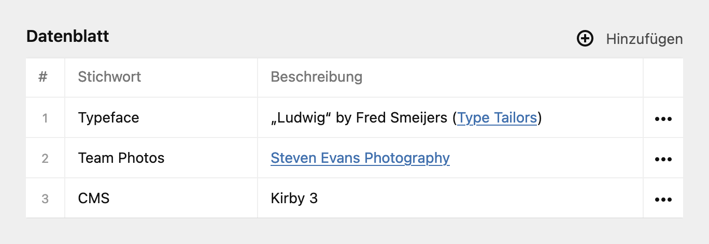

**Structure: Textarea Preview** is a plugin for [Kirby 3](https://getkirby.com) offering Markdown [preview for textareas](https://getkirby.com/docs/reference/plugins/extensions/field-previews) in structure fields.

## Screenshots

Input with Markdown:



Preview:



## Installation

### Download

Download and copy this repository to `/site/plugins/structure-textarea-preview`.

### Git submodule

```
git submodule add https://github.com/hananils/kirby-structure-textarea-preview.git site/plugins/structure-textarea-preview
```

### Composer

```
composer require hananils/kirby-structure-textarea-preview
```

# License

This plugin is provided freely under the [MIT license](LICENSE.md) by [hana+nils · Büro für Gestaltung](https://hananils.de).
We create visual designs for digital and analog media.
